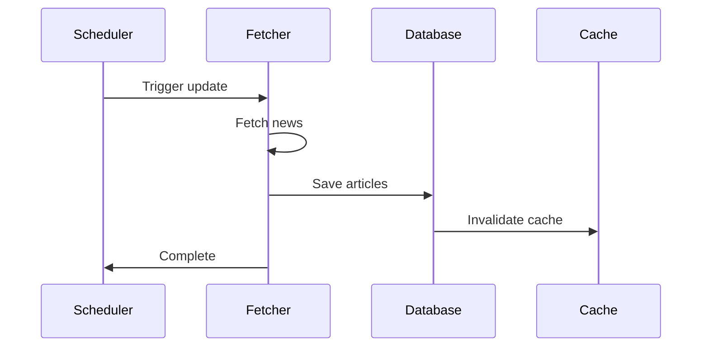
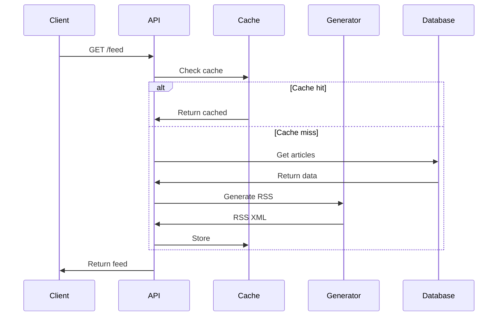

# Data Flow

Documentation of how data flows through the LoL Stonks RSS system.

## 🔄 Update Flow

## 📡 Request Flow

## 📚 Learn More

- [Architecture Overview](overview.md)
- [Components](components.md)
- [Performance](performance.md)
