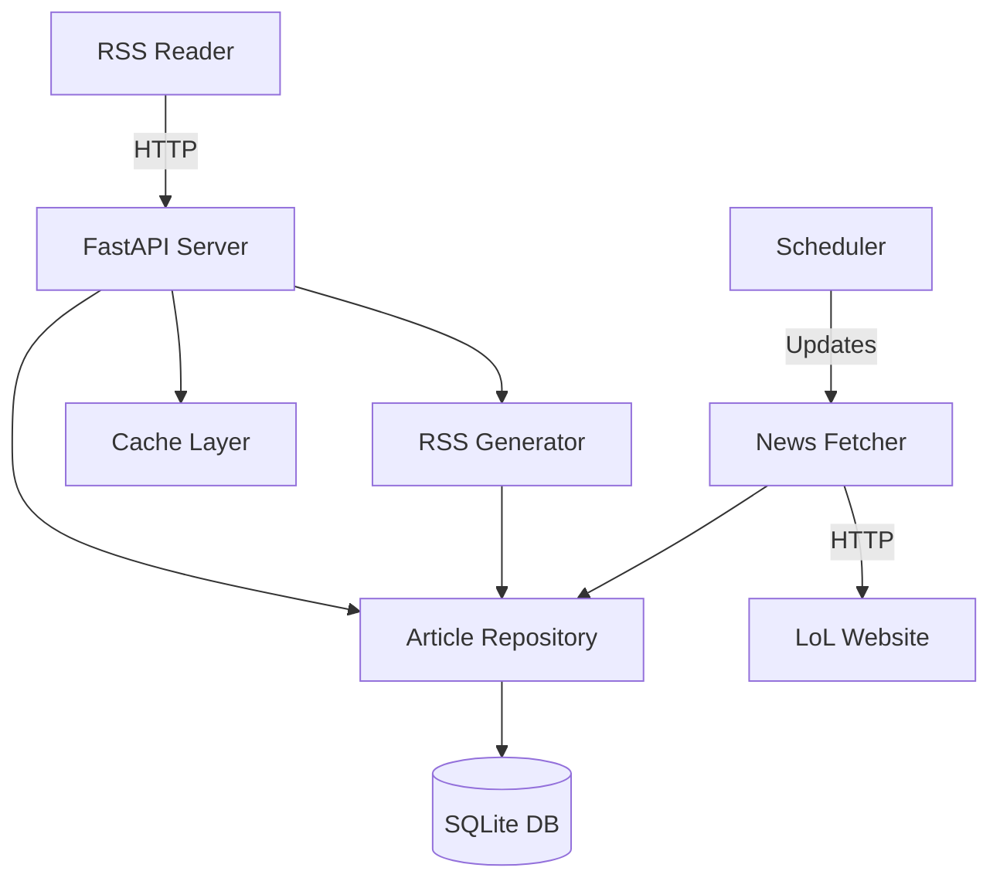
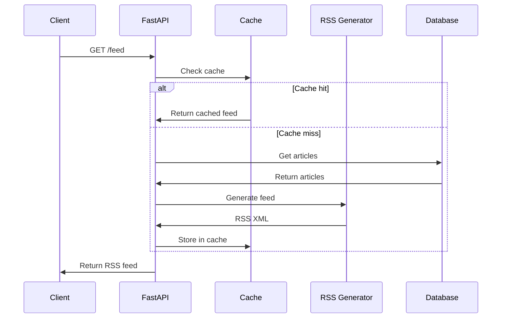
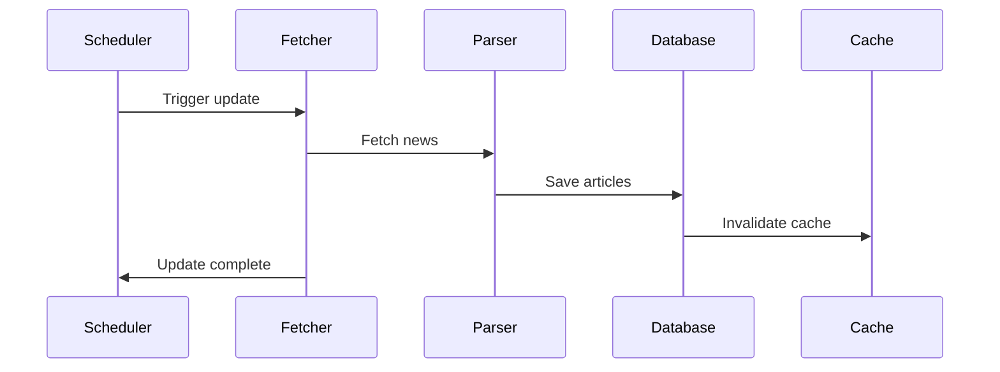
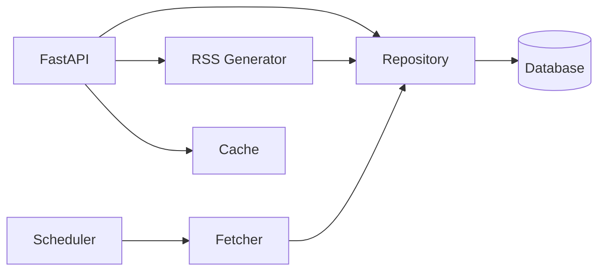

# Architecture

Comprehensive documentation of LoL Stonks RSS system architecture and design.

## 🏗️ Overview

<div class="feature-grid">
  <div class="feature-card">
    <h3>📐 System Overview</h3>
    <p>High-level architecture and components</p>
    <a href="overview/">Overview →</a>
  </div>

  <div class="feature-card">
    <h3>🔧 Components</h3>
    <p>Detailed component documentation</p>
    <a href="components/">Components →</a>
  </div>

  <div class="feature-card">
    <h3>🔄 Data Flow</h3>
    <p>How data flows through the system</p>
    <a href="data-flow/">Data Flow →</a>
  </div>

  <div class="feature-card">
    <h3>⚡ Performance</h3>
    <p>Performance optimization and metrics</p>
    <a href="performance/">Performance →</a>
  </div>

  <div class="feature-card">
    <h3>🔒 Security</h3>
    <p>Security architecture and practices</p>
    <a href="security/">Security →</a>
  </div>
</div>

## 🎯 High-Level Architecture



## 🔧 Core Components

### 1. Web Server (FastAPI)
- REST API endpoints
- RSS feed serving
- Request handling
- Rate limiting

### 2. RSS Generator
- Feed generation
- XML formatting
- Content transformation

### 3. News Fetcher
- Web scraping
- Content parsing
- Data extraction

### 4. Article Repository
- Data persistence
- CRUD operations
- Query optimization

### 5. Scheduler
- Automated updates
- Task scheduling
- Background jobs

### 6. Cache Layer
- Response caching
- Performance optimization
- TTL management

## 🗂️ Project Structure

```
lolstonksrss/
├── src/
│   ├── api/              # API endpoints
│   ├── rss/              # RSS generation
│   ├── fetchers/         # News fetchers
│   ├── models.py         # Data models
│   ├── database.py       # Repository
│   ├── config.py         # Configuration
│   └── utils/            # Utilities
├── tests/                # Test suite
├── docs/                 # Documentation
├── data/                 # Database storage
├── main.py              # Application entry
└── Dockerfile           # Container config
```

## 🔄 Request Flow

### RSS Feed Request



### Update Cycle



## 📊 Technology Stack

### Backend
- **Python 3.11+** - Programming language
- **FastAPI** - Web framework
- **Uvicorn** - ASGI server
- **Pydantic** - Data validation

### Data Layer
- **SQLite** - Database
- **aiosqlite** - Async database driver
- **feedgen** - RSS generation
- **feedparser** - RSS parsing

### Task Management
- **APScheduler** - Task scheduling
- **httpx** - HTTP client

### Development
- **pytest** - Testing framework
- **black** - Code formatting
- **mypy** - Type checking
- **ruff** - Linting

### Deployment
- **Docker** - Containerization
- **Docker Compose** - Orchestration

## 🎨 Design Principles

### 1. Separation of Concerns
Each component has a single, well-defined responsibility.

### 2. Async by Default
All I/O operations use async/await for better performance.

### 3. Type Safety
Full type hints throughout the codebase.

### 4. Testability
Comprehensive test coverage (95%+).

### 5. Configuration
Environment-based configuration for flexibility.

### 6. Observability
Structured logging and health checks.

## 🔒 Security Architecture

### Layers of Security

1. **Input Validation** - Pydantic models
2. **Rate Limiting** - SlowAPI middleware
3. **SQL Injection Prevention** - Parameterized queries
4. **XSS Prevention** - XML escaping
5. **CORS Configuration** - Controlled origins

See [Security Guide](security.md) for details.

## ⚡ Performance Characteristics

### Response Times
- RSS feed: \<100ms (cached)
- API endpoints: \<50ms
- Update cycle: 5-30 seconds

### Resource Usage
- Memory: ~100-200MB
- CPU: \<10% (idle), ~50% (updating)
- Disk: ~50MB + data

### Scalability
- Handles 1000+ requests/minute
- Supports 10,000+ articles
- Horizontal scaling ready

See [Performance Guide](performance.md) for optimization.

## 🔄 Data Flow Patterns

### Write Path
```
News Source → Fetcher → Parser → Validator → Repository → Database
```

### Read Path
```
Client → FastAPI → Cache → Repository → Database
                    ↓
               RSS Generator
```

## 🧩 Component Interactions



## 📚 Additional Resources

- [System Overview](overview.md)
- [Component Details](components.md)
- [Data Flow](data-flow.md)
- [Performance](performance.md)
- [Security](security.md)

## 🔍 Deep Dive Topics

### Database Design
- Schema design
- Indexing strategy
- Query optimization

### Caching Strategy
- TTL configuration
- Cache invalidation
- Cache warming

### Async Patterns
- Async/await usage
- Event loop management
- Connection pooling

### Error Handling
- Exception hierarchy
- Retry strategies
- Graceful degradation

## 💡 Architecture Decisions

### Why SQLite?
- Simple deployment
- No separate database server
- Good performance for read-heavy workload
- ACID compliance

### Why FastAPI?
- Modern async framework
- Automatic API documentation
- Type validation
- High performance

### Why Docker?
- Consistent deployment
- Easy scaling
- Isolation
- Portability

## 🚀 Future Enhancements

Potential architectural improvements:

- [ ] Redis for distributed caching
- [ ] PostgreSQL for larger scale
- [ ] Message queue for updates
- [ ] Microservices architecture
- [ ] GraphQL API
- [ ] WebSocket support

## 📖 Related Documentation

- [Developer Guide](../development/guide.md)
- [API Reference](../api/)
- [Deployment Guide](../guides/deployment/)
