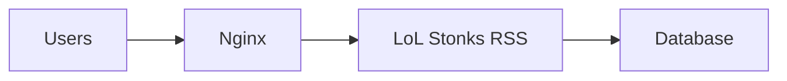
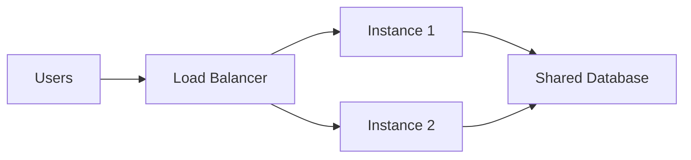

# Deployment Guide

Learn how to deploy LoL Stonks RSS to production environments.

## 🚀 Deployment Options

<div class="feature-grid">
  <div class="feature-card">
    <h3>🐳 Docker</h3>
    <p>Containerized deployment with Docker</p>
    <a href="docker/">Docker Guide →</a>
  </div>

  <div class="feature-card">
    <h3>🪟 Windows Server</h3>
    <p>Deploy on Windows Server</p>
    <a href="windows/">Windows Guide →</a>
  </div>

  <div class="feature-card">
    <h3>✅ Production Checklist</h3>
    <p>Pre-deployment checklist</p>
    <a href="production-checklist/">Checklist →</a>
  </div>
</div>

## 🎯 Quick Deployment

### Docker (Recommended)

```bash
# Pull latest image
docker pull yourusername/lolstonksrss:latest

# Run with production settings
docker run -d \
  --name lolstonks \
  -p 8000:8000 \
  --restart unless-stopped \
  -e FEED_TITLE="Production Feed" \
  -e LOG_LEVEL=INFO \
  -v ./data:/app/data \
  lolstonksrss
```

### Docker Compose

```yaml
version: '3.8'

services:
  lolstonksrss:
    image: yourusername/lolstonksrss:latest
    container_name: lolstonks
    ports:
      - "8000:8000"
    environment:
      - FEED_TITLE=Production LoL News
      - UPDATE_INTERVAL=3600
      - LOG_LEVEL=INFO
    volumes:
      - ./data:/app/data
    restart: unless-stopped
    healthcheck:
      test: ["CMD", "curl", "-f", "http://localhost:8000/health"]
      interval: 30s
      timeout: 10s
      retries: 3
```

## 🏗️ Architecture Patterns

### Single Server



### Load Balanced



## 🔒 Security Configuration

### Reverse Proxy (Nginx)

```nginx
server {
    listen 80;
    server_name rss.example.com;

    # Redirect to HTTPS
    return 301 https://$server_name$request_uri;
}

server {
    listen 443 ssl http2;
    server_name rss.example.com;

    ssl_certificate /etc/letsencrypt/live/rss.example.com/fullchain.pem;
    ssl_certificate_key /etc/letsencrypt/live/rss.example.com/privkey.pem;

    location / {
        proxy_pass http://localhost:8000;
        proxy_set_header Host $host;
        proxy_set_header X-Real-IP $remote_addr;
        proxy_set_header X-Forwarded-For $proxy_add_x_forwarded_for;
        proxy_set_header X-Forwarded-Proto $scheme;
    }
}
```

### SSL/TLS with Let's Encrypt

```bash
# Install certbot
sudo apt install certbot python3-certbot-nginx

# Get certificate
sudo certbot --nginx -d rss.example.com

# Auto-renewal
sudo certbot renew --dry-run
```

## 📊 Monitoring

### Health Checks

```bash
# Simple health check
curl http://localhost:8000/health

# Monitor with watch
watch -n 5 'curl -s http://localhost:8000/health | jq'
```

### Logging

```bash
# Docker logs
docker logs -f lolstonks

# Save to file
docker logs lolstonks > lolstonks.log 2>&1
```

### Metrics

```bash
# Get statistics
curl http://localhost:8000/api/v1/stats

# Monitor response time
curl -w "Time: %{time_total}s\n" \
  -o /dev/null -s \
  http://localhost:8000/feed
```

## 🔄 Updates & Maintenance

### Update Strategy

1. **Pull new image**
   ```bash
   docker pull yourusername/lolstonksrss:latest
   ```

2. **Backup database**
   ```bash
   docker cp lolstonks:/app/data/articles.db ./backup/
   ```

3. **Update container**
   ```bash
   docker-compose down
   docker-compose up -d
   ```

4. **Verify**
   ```bash
   curl http://localhost:8000/health
   ```

### Backup Strategy

```bash
#!/bin/bash
# backup.sh

DATE=$(date +%Y%m%d_%H%M%S)
BACKUP_DIR="/backups/lolstonks"

# Backup database
docker cp lolstonks:/app/data/articles.db \
  ${BACKUP_DIR}/articles_${DATE}.db

# Keep last 7 days
find ${BACKUP_DIR} -name "articles_*.db" -mtime +7 -delete
```

## 🌐 Environment-Specific Configs

### Development

```bash
# .env.dev
LOG_LEVEL=DEBUG
UPDATE_INTERVAL=300
RSS_MAX_ITEMS=10
```

### Staging

```bash
# .env.staging
LOG_LEVEL=INFO
UPDATE_INTERVAL=1800
RSS_MAX_ITEMS=25
```

### Production

```bash
# .env.prod
LOG_LEVEL=WARNING
UPDATE_INTERVAL=3600
RSS_MAX_ITEMS=50
```

## 📈 Scaling

### Vertical Scaling

Increase container resources:
```yaml
services:
  lolstonksrss:
    deploy:
      resources:
        limits:
          cpus: '2'
          memory: 2G
        reservations:
          cpus: '1'
          memory: 512M
```

### Horizontal Scaling

Multiple instances with shared database:
```yaml
services:
  lolstonksrss:
    image: yourusername/lolstonksrss:latest
    deploy:
      replicas: 3
    volumes:
      - shared-db:/app/data

volumes:
  shared-db:
```

## 🆘 Troubleshooting Deployment

### Container Won't Start

```bash
# Check logs
docker logs lolstonks

# Inspect container
docker inspect lolstonks

# Check events
docker events --since 10m
```

### Performance Issues

```bash
# Check resource usage
docker stats lolstonks

# Monitor system
top
htop
```

### Network Issues

```bash
# Check port binding
netstat -tlnp | grep 8000

# Test connectivity
curl -v http://localhost:8000/health
```

## 📚 Additional Resources

- [Docker Deployment Guide](docker.md)
- [Windows Deployment Guide](windows.md)
- [Production Checklist](production-checklist.md)
- [Performance Guide](../../architecture/performance.md)
- [Security Guide](../../architecture/security.md)

## ✅ Pre-Deployment Checklist

Before deploying to production, review the [Production Checklist](production-checklist.md):

- [ ] Environment variables configured
- [ ] Database backup strategy in place
- [ ] Monitoring and logging set up
- [ ] SSL/TLS certificate configured
- [ ] Firewall rules configured
- [ ] Health checks working
- [ ] Update procedure documented
- [ ] Rollback plan prepared

## 🚀 Next Steps

1. Choose your deployment method
2. Review security configuration
3. Set up monitoring
4. Test in staging
5. Deploy to production
6. Monitor and maintain

For detailed platform-specific instructions, see:
- [Docker Deployment](docker.md)
- [Windows Server Deployment](windows.md)
